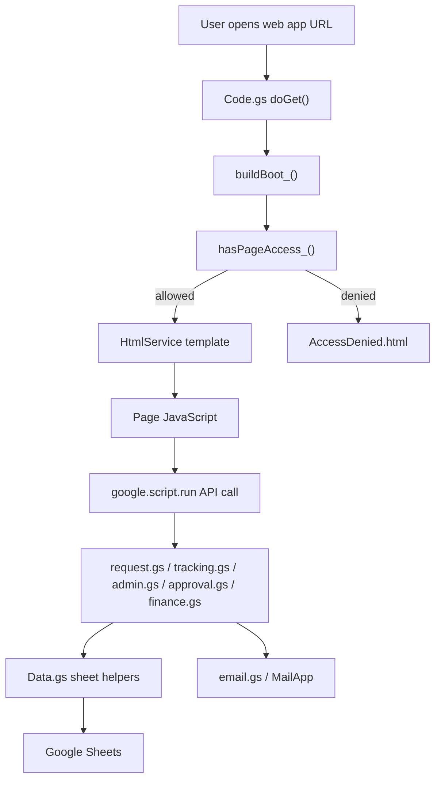
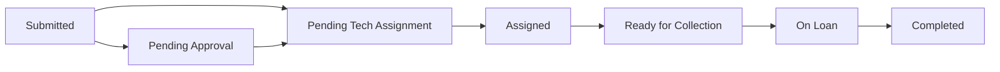
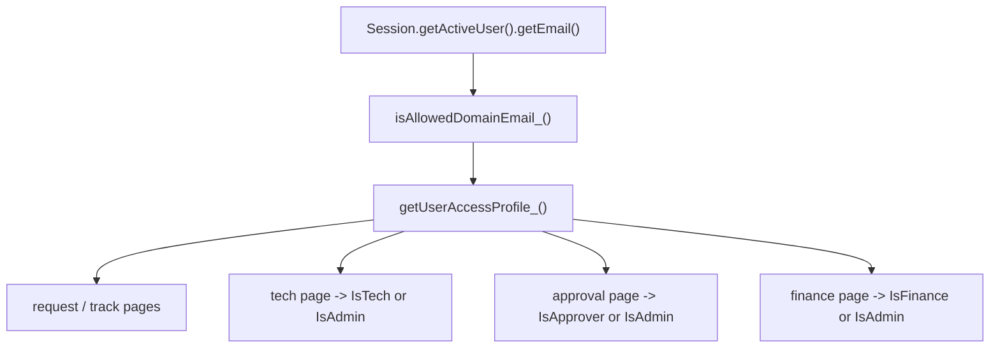
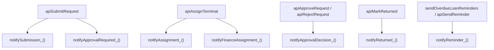

# Architecture

## Overview

This application is a Google Apps Script web app backed by Google Sheets. The runtime uses HtmlService templates for the UI and server-side `.gs` files for data access, workflow logic, access control, and email notifications.

## Main Components

| Area | Files | Responsibility |
| --- | --- | --- |
| Routing and boot | `Code.gs`, `AccessDenied.html`, `ErrorPage.html` | `doGet`, page selection, boot payload, page-level access checks |
| Configuration | `Config.gs`, `Setup.gs` | bootstrap constants, config lookup, sheet setup, config seeding |
| Shared helpers | `Util.gs`, `Data.gs`, `Styles.html`, `Scripts.html` | formatting, normalization, memoized sheet reads, role parsing, shared UI behavior |
| Request flow | `Index.html`, `request.gs` | request form, validation, request submission, request summary |
| Tracking flow | `Track.html`, `TrackView.html`, `tracking.gs` | tracking search, request detail lookup, history rendering, reminder/cancel actions |
| Tech flow | `TechDashboard.html`, `admin.gs`, `availability.gs` | assignment queue, terminal availability, assignment, collection, return, terminal status |
| Approval flow | `ApprovalDashboard.html`, `approval.gs` | approval-required queue and decision handling |
| Finance flow | `FinancePortal.html`, `finance.gs` | read-only finance view and filtering |
| Notifications | `email.gs`, `reminder.gs` | transactional email generation and reminder sending |
| Workflow utilities | `workflow.gs`, `WebApp.gs`, `Flow.gs` | status transition helper and backward-compatible wrappers |

## Spreadsheet Model

The project expects these sheets:

| Sheet | Purpose |
| --- | --- |
| `Requests` | Main request records and workflow state |
| `Terminals` | Authoritative terminal inventory and status |
| `Workflow_Log` | Request lifecycle audit trail |
| `Config` | Runtime configuration, URLs, recipients, feature flags |
| `Email_Log` | Basic email audit log |
| `User_Roles` | Role-based access control |

## Runtime Flow

## Request Lifecycle

Notes:

- The exact status values preserve some backward-compatible aliases.
- Finance visibility is driven by request state plus assignment context.

## Access-Control Flow

## Email Flow

## Important Compatibility Notes

- `Config.gs` preserves legacy config keys such as `TECH_EMAILS` and `FINANCE_EMAILS`.
- `Setup.gs` preserves mixed request-column aliases for backward compatibility.
- The root wrapper templates with spaces in their filenames still exist intentionally as compatibility shims.

## External Services Used

- `SpreadsheetApp`
- `HtmlService`
- `MailApp`
- `LockService`
- `Session`
- `ScriptApp`
- `Utilities`

