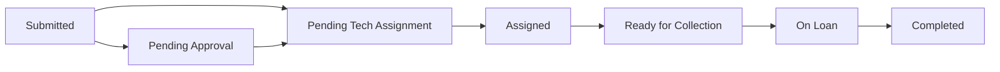

# Workflow

## Main User Flow

1. Requester submits a terminal request
2. Tech assigns a terminal
3. Finance gets read-only visibility
4. Requester tracks progress by Request ID
5. Tech marks the request returned / completed

## Lifecycle

## Supporting Flows

- approval-required requests move through the approval dashboard
- finance visibility is read-only
- reminder flow is optional and time-triggered

For the full architecture view, see [../ARCHITECTURE.md](../ARCHITECTURE.md).

